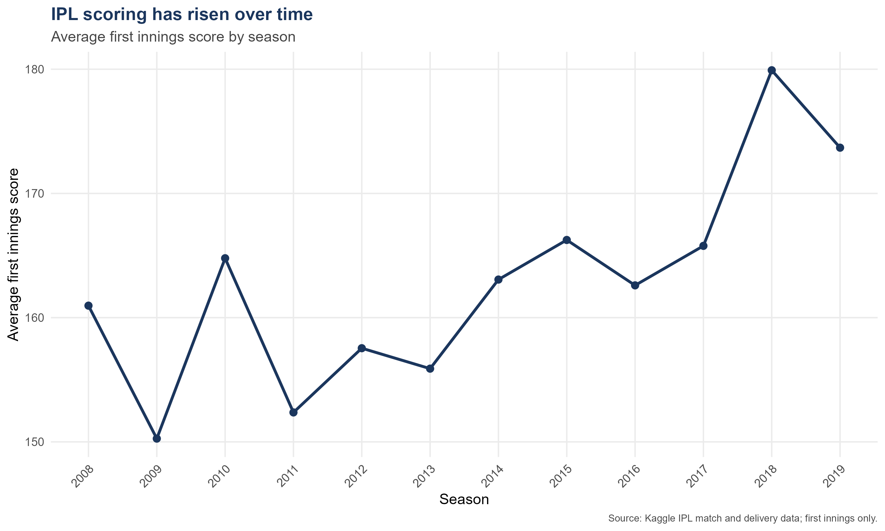
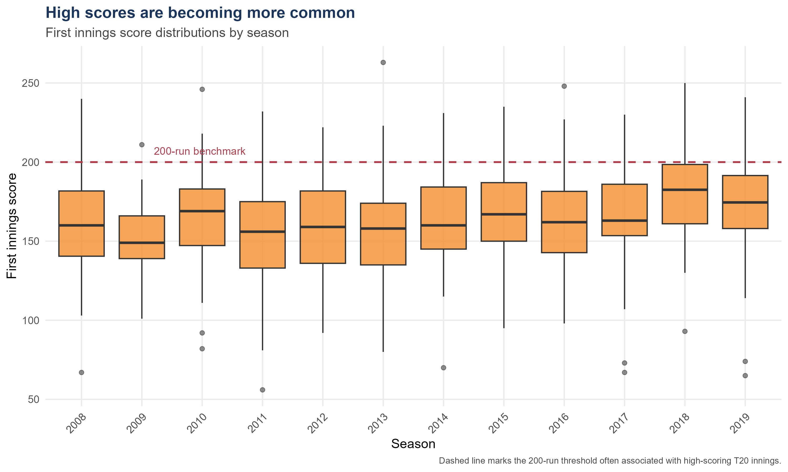
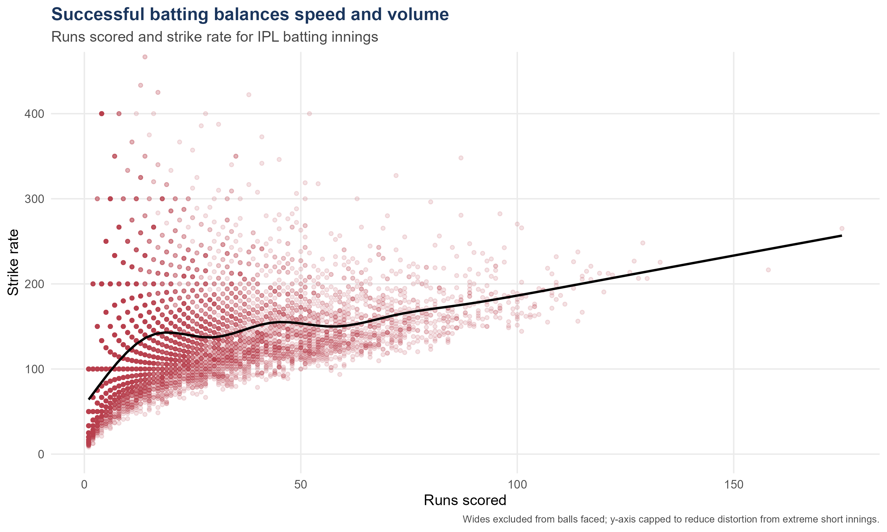
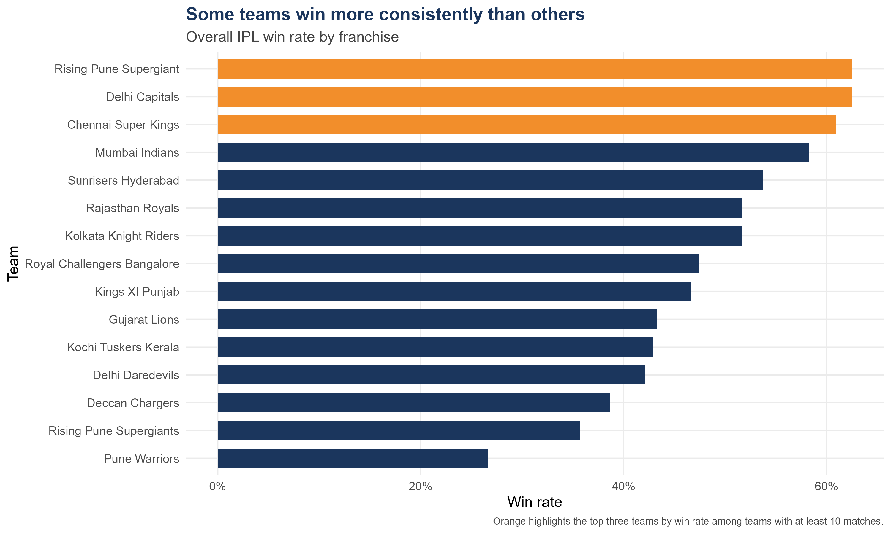
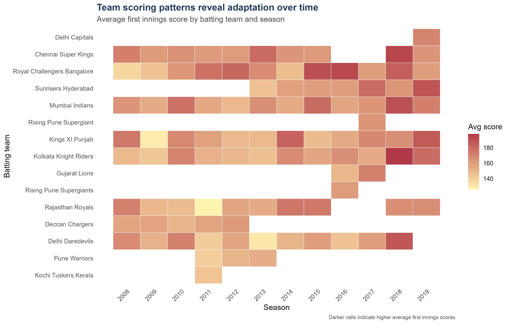

# IPL Data Visualisation in R

This repository contains the **original R/Quarto analysis files** from my IPL data-visualisation project, together with the datasets, exported figures, and final report.

The original `.qmd` code files have been kept unchanged so the repository reflects the work as it was actually completed. Only submission-only material such as AI-use documentation, development records, and the final submission checklist has been left out of this GitHub version.

## Project overview

The project analyses Indian Premier League (IPL) match and ball-by-ball data using **R, tidyverse, ggplot2, Quarto, Plotly, DT, and scales**.

The analysis explores:

- changes in average first-innings scoring over time
- the distribution of first-innings scores by season
- the relationship between batter runs and strike rate
- franchise win rates
- team scoring patterns across seasons

## Main visualisations

### 1. Average first-innings score by season



### 2. Distribution of first-innings scores



### 3. Runs scored vs strike rate



### 4. Team win rate



### 5. Team scoring heatmap



## Repository structure

```text
IPL-Data-Visualisation-Original-Portfolio/
├── README.md
├── .gitignore
├── code/
│   ├── 2_Interactive_IPL_Explorer.qmd
│   ├── 2_Interactive_IPL_Explorer.html
│   ├── 2_Interactive_IPL_Explorer_files/
│   ├── 3_Annotated_Code.qmd
│   ├── 3_Annotated_Code.html
│   └── 3_Annotated_Code_files/
├── data/
│   ├── matches.csv
│   └── deliveries.csv
├── images/
│   ├── fig1_avg_score_trend.png
│   ├── fig2_score_distribution.png
│   ├── fig3_runs_vs_strike_rate.png
│   ├── fig4_team_win_rate.png
│   └── fig5_team_score_heatmap.png
└── report/
    ├── 1_Data_Story_Report.pdf
    └── 1_Data_Story_Report.docx
```

## R skills demonstrated

The project uses:

- `read_csv()` for data import
- `select()`, `rename()`, `filter()`, and `mutate()` for data preparation
- `group_by()` and `summarise()` for aggregation
- `left_join()` and `bind_rows()` for combining datasets
- `is.na()` and `na.rm = TRUE` for missing-value handling
- `ggplot2` for line charts, boxplots, scatterplots, bar charts, and heatmaps
- `reorder()` and factors for category ordering
- `plotly` and `DT` for interactive exploration
- Quarto for reproducible reporting

## Running the project

Install the required R packages if needed:

```r
install.packages(c(
  "tidyverse",
  "scales",
  "plotly",
  "DT",
  "htmltools"
))
```

Then open either of the original Quarto files in RStudio:

```text
code/3_Annotated_Code.qmd
code/2_Interactive_IPL_Explorer.qmd
```

The project uses relative paths and expects the supplied CSV files to remain in the `data/` folder.

## Notes

This GitHub version intentionally preserves the original analysis files rather than rewriting them into a new portfolio-style codebase. That makes the repository a transparent record of the project and the R workflow used to build it.
